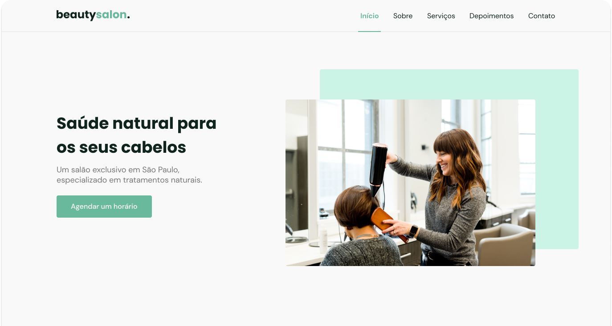

<h1 align="center"> Beauty Salon </h1>

  

## 🚀 Technologies

This project was developed with the following technologies:

- HTML e CSS
- JavaScript
- Git e Github
- Figma

## 💻 Project

O Beauty Salon is a mock web page for a hair salon and spa.

- [Access the final project online](https://arthurfamaral95.github.io/BeautySalon/)

## 🔖 Layout

You can check the project layout through [THIS LINK](<https://www.figma.com/file/OhizpBgTMWfM2vAewn5IYO/Origin-Six-(Community)?node-id=0%3A1&mode=dev>). It is necessary to have a [Figma](https://figma.com) account to access it.
